<!-- Header wave -->


<!-- Typing animation -->
<p align="center">
  <a href="https://github.com/patilanupam">
    
  </a>
</p>

<!-- Social badges row -->
<p align="center">
  <a href="https://www.linkedin.com/in/anupam-patil/" target="_blank">
    
  </a>
  <a href="mailto:anupampatil9@gmail.com" target="_blank">
    
  </a>
  <a href="https://drive.google.com/file/d/1WvjmN2O5wi5_eFoWM9_ae-PoZjDIurqE/view?usp=drive_link" target="_blank">
    
  </a>
  
</p>

---

## 🧠 About Me

```python
class AnupamPatil:
    def __init__(self):
        self.name        = "Anupam Patil"
        self.role        = "AI / GenAI Engineer"
        self.email       = "anupampatil9@gmail.com"

    @property
    def currently(self):
        return {
            "building" : ["Agentic LLM", "RAG Pipelines", "Custom Chatbots"],
            "learning" : ["Multi-Agent Workflows", "LLM Governance"],
            "ask_me"   : ["Azure Cloud", "GenAI", "Python", "FastAPI"],
        }

    def fun_fact(self):
        return "I turn messy data into intelligent, real-world impact 🚀"
```

---

## 🛠️ Tech Stack

### 🤖 AI / ML / GenAI
<p>
  
  
  
  
  
  
  
  
</p>

### ☁️ Cloud & DevOps
<p>
  
  
  
  
</p>

### 🗄️ Data & Backend
<p>
  
  
  
  
  
</p>

### 🌐 Frontend
<p>
  
  
  
  
  
</p>

---

## 🚀 Featured Projects

<table>
  <tr>
    <td width="50%">
      <h3 align="center">🎫 GenAI KATA Tickets Dashboard</h3>
      <p align="center">
        <a href="https://github.com/patilanupam/GenAI_KATA_Tickets_Dashboard" target="_blank">
          
        </a>
      </p>
      <p align="center">Support Ticket Analysis via a custom GenAI-powered dashboard with data visualization.</p>
      <p align="center">
        
        
      </p>
    </td>
    <td width="50%">
      <h3 align="center">✍️ ContentForge</h3>
      <p align="center">
        <a href="https://github.com/patilanupam/ContentForge" target="_blank">
          
        </a>
      </p>
      <p align="center">Forge content compatible with any social media platform using Gemini &amp; Claude AI.</p>
      <p align="center">
        
        
      </p>
    </td>
  </tr>
  <tr>
    <td width="50%">
      <h3 align="center">🎬 Multimodal Movie Classification</h3>
      <p align="center">
        <a href="https://github.com/patilanupam/Multimodal-Movie-Genre-Classification" target="_blank">
          
        </a>
      </p>
      <p align="center">Multimodal NLP + Image classification for movie genre prediction.</p>
      <p align="center">
        
        
      </p>
    </td>
    <td width="50%">
      <h3 align="center">📰 Duck Duck Go News Summarizer</h3>
      <p align="center">
        <a href="https://github.com/patilanupam/Duck_Duck_Go_News_Summarizer" target="_blank">
          
        </a>
      </p>
      <p align="center">AI-powered news aggregator and summarizer using DuckDuckGo search.</p>
      <p align="center">
        
        
      </p>
    </td>
  </tr>
</table>

---

## 📊 GitHub Stats

<div align="center">
  
  
</div>

<div align="center">
  
</div>

<div align="center">
  
</div>

---

## 🏆 GitHub Trophies

<div align="center">
  
</div>

---

## 🤝 Let's Connect

<div align="center">
  <a href="https://www.linkedin.com/in/anupam-patil/" target="_blank">
    
  </a>
  <a href="mailto:anupampatil9@gmail.com" target="_blank">
    
  </a>
  <a href="https://drive.google.com/file/d/1WvjmN2O5wi5_eFoWM9_ae-PoZjDIurqE/view?usp=drive_link" target="_blank">
    
  </a>
  <a href="https://medium.com/" target="_blank">
    
  </a>
</div>

<br clear="both">

<!-- Footer wave -->

